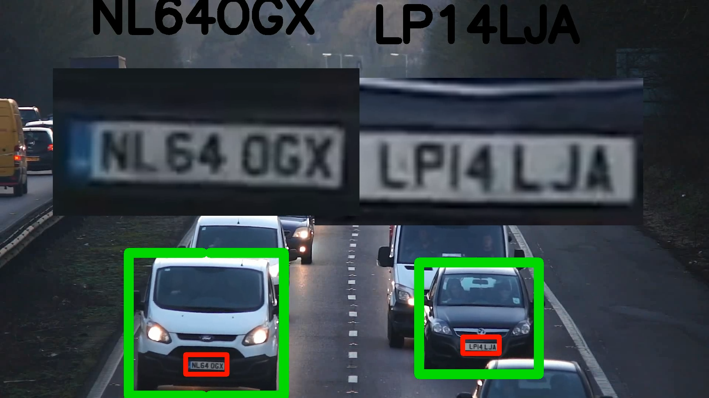

# License Plate Detection System using YOLOv8

This repository contains a vehicle and license plate detection system built using YOLO (You Only Look Once) models for real-time object detection and SORT (Simple Online and Realtime Tracking) for object tracking. The system is designed to detect vehicles, track them across video frames, and read license plate numbers using Optical Character Recognition (OCR).

[](image-and-video/out.mp4 "Watch video")

## Table of Contents

- [Introduction](#introduction)
- [Features](#features)
- [Installation](#installation)
- [Usage](#usage)
  - [Main Script](#main-script)
  - [Real-time Detection](#real-time-detection)
  - [Utilities](#utilities)
  - [Visualization](#visualization)
- [Files and Directories](#files-and-directories)
- [Contributing](#contributing)
- [License](#license)

## Introduction

This project leverages the power of deep learning models for detecting vehicles and license plates in video footage. The primary objectives of this project are:

1. Detect vehicles in each frame of the video.
2. Track detected vehicles across frames.
3. Detect and read license plates from the detected vehicles.
4. Store the detection results in a CSV file.
5. Interpolate missing data for smoother results.
6. Visualize the results in an output video.

## Features

- **Vehicle Detection**: Uses YOLOv8 for detecting vehicles in video frames.
- **License Plate Detection**: Uses YOLO to detect license plates on the vehicles.
- **OCR for License Plates**: Utilizes EasyOCR to read the text on license plates.
- **Tracking**: Implements SORT to track vehicles across video frames.
- **Data Interpolation**: Interpolates missing data to ensure smooth tracking results.
- **Visualization**: Draws bounding boxes and annotations on video frames for visualization.

## Installation

### Prerequisites

- Python 3.7 or higher
- Easyocr 1.7.1
- Filterpy 1.4.5
- Lap 0.4.0
- Matplotlib 3.8.3
- Numpy 1.26.4
- OpenCV 4.9.0.80
- Pandas 2.2.2
- Scipy 1.13.1
- Skimage 0.0
- Ultralytics 8.2.25

    ```sh
    pip install -r requirements.txt
    ```

### Setup

1. Clone the repository:

    ```sh
    git clone https://github.com/sayan18012004/License-Plate-Detector-using-YOLOv8.git
    cd License-Plate-Detector-using-YOLOv8
    ```

2. Install the required packages:

    ```sh
    pip install -r requirements.txt
    ```

3. YOLO models for vehicle detection and license plate detection can be found in the `model/for-detecting-cars/` and `model/for-detecting-license-plates/` directories respectively.

4. The video file that is used as example is stored in `dataset/testing/` and the the generated CSV files are stored in `csv-file/`. You can run this program as it is after removing both the csv files and you will get the output video based on the example video.

## Usage

### Main Script

The main script, `main.py`, processes a video to detect and track vehicles and their license plates. It outputs a CSV file with the detection results and visualizes the results in an output video.

To run the main script:

```sh
python main.py
```

### Real-time Detection

The `real-time-detection.py` script uses a webcam feed to detect license plates in real-time. It is seperate code that you can use to just detect the licenses from a video feed as it uses only one of the models.

To run the real-time detection script:

```sh
python real-time-detection.py
```

### Utilities

The `util.py` script contains utility functions for reading license plates, writing results to a CSV file, and mapping characters for OCR.

### Visualization

The `visualize.py` script is used to draw bounding boxes and annotations on video frames for visualization purposes.

## Files and Directories

- `main.py`: The main script for processing video files.
- `add_missing_data.py`: Script for interpolating missing data.
- `real-time-detection.py`: Stand alone script for real-time license plate detection using an incoming video feed.
- `util.py`: Utility functions for OCR, CSV writing, and character mapping.
- `visualize.py`: Functions for visualizing detection results.
- `model/for-detecting-cars/`: Directory that stores the YOLO model for vehicle detection.
- `model/for-detecting-license-plates/`: Directory that stores the YOLO model for license plate detection.
- `dataset/testing/`: Directory to store the video file to be processed.
- `csv-files/`: Directory to store the output CSV files.

## Contributing

Contributions are welcome! Please follow these steps to contribute:

1. Fork the repository.
2. Create a new branch (`git checkout -b feature/your-feature`).
3. Make your changes.
4. Commit your changes (`git commit -am 'Add new feature'`).
5. Push to the branch (`git push origin feature/your-feature`).
6. Create a new Pull Request.